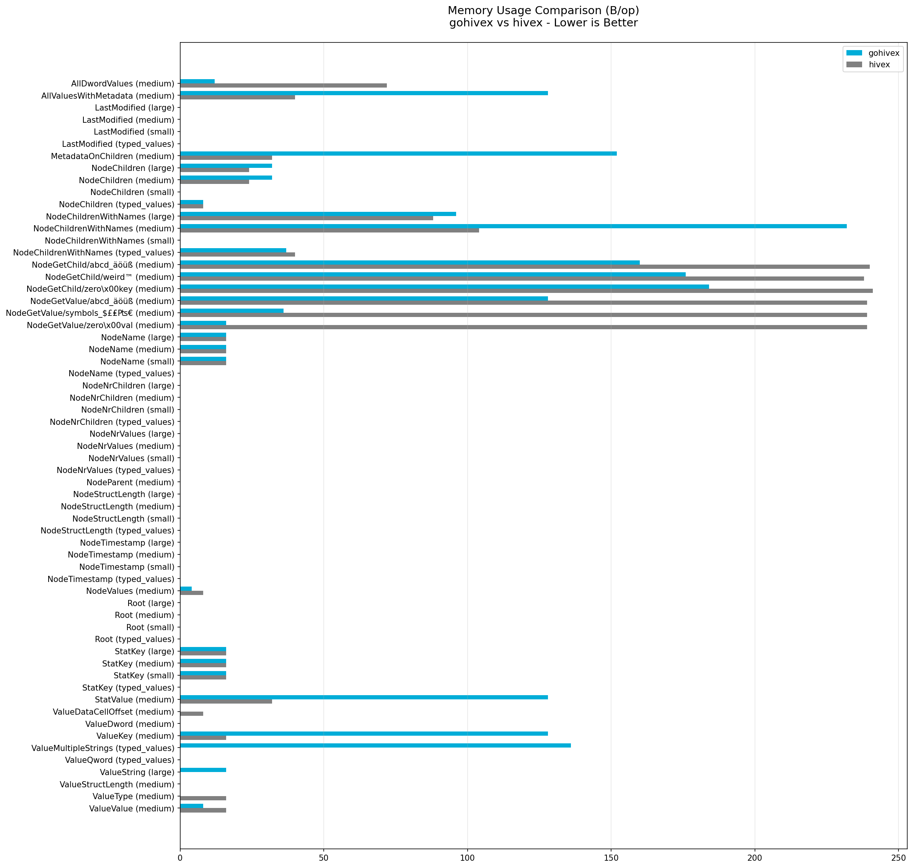
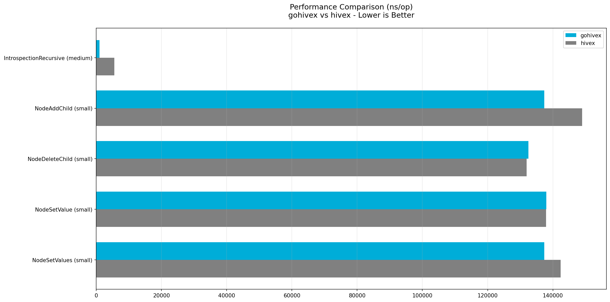
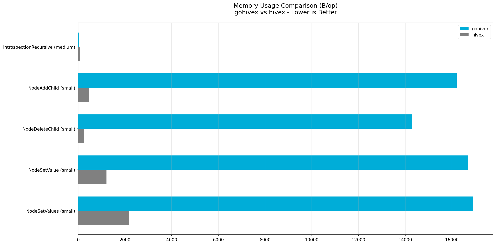
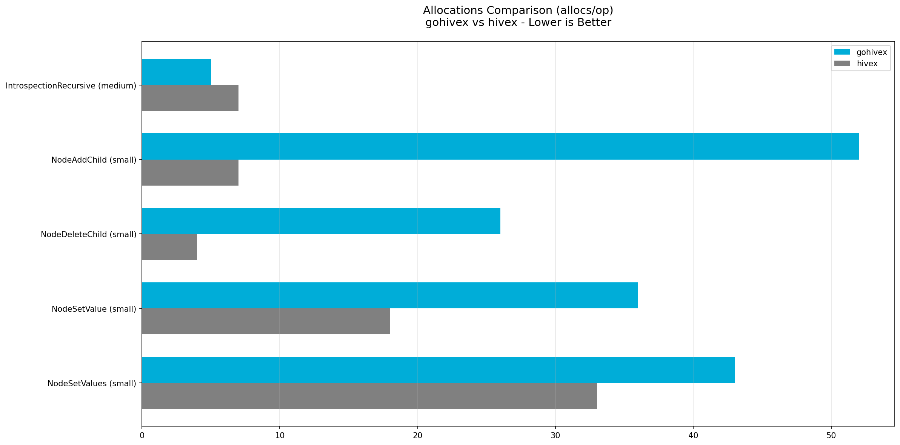

# Benchmark Report

Generated: 2025-10-28 23:38:10

## Summary

- **Total benchmarks**: 66
- **Comparable** (both implementations): 64
  - gohivex faster: 47 (73.4%)
  - hivex faster: 17 (26.6%)
  - Average speedup: **5.28x**
- **gohivex-only features**: 2

## Standard Operations

Performance comparison for read operations and basic traversal.

### Time Comparison (ns/op)

### Memory Usage (B/op)

### Allocations (allocs/op)

## Mutation Operations

Performance comparison for write operations and recursive traversal.

### Time Comparison (ns/op)

### Memory Usage (B/op)

### Allocations (allocs/op)

## Detailed Results

| Operation | Hive | gohivex (ns/op) | hivex (ns/op) | Speedup | Memory (B/op) | Allocs |
|-----------|------|-----------------|---------------|---------|---------------|--------|
| AllDwordValues | medium | 404 | 813 | **2.01x** ✓ | 12B vs 72B ✓ | 3 vs 9 ✓ |
| AllValuesWithMetadata | medium | 233 | 1.4K | **6.02x** ✓ | 128B vs 40B ✗ | 6 vs 4 ✗ |
| IntrospectionRecursive | medium | 944 | 5.5K | **5.86x** ✓ | 40B vs 72B ✓ | 5 vs 7 ✓ |
| LastModified | large | 8 | 36 | **4.48x** ✓ | 0B vs 0B | 0 vs 0 |
| LastModified | medium | 8 | 36 | **4.45x** ✓ | 0B vs 0B | 0 vs 0 |
| LastModified | small | 8 | 37 | **4.66x** ✓ | 0B vs 0B | 0 vs 0 |
| LastModified | typed_values | 7 | 36 | **4.88x** ✓ | 0B vs 0B | 0 vs 0 |
| MetadataOnChildren | medium | 340 | 2.7K | **7.86x** ✓ | 152B vs 32B ✗ | 7 vs 3 ✗ |
| NodeAddChild | small | 130.9K | 126.4K | 0.97x ✗ | 15.8KB vs 466B ✗ | 52 vs 7 ✗ |
| NodeChildren | large | 121 | 196 | **1.62x** ✓ | 32B vs 24B ✗ | 2 vs 1 ✗ |
| NodeChildren | medium | 85 | 191 | **2.25x** ✓ | 32B vs 24B ✗ | 2 vs 1 ✗ |
| NodeChildren | small | 43 | 38 | 0.89x ✗ | 0B vs 0B | 0 vs 0 |
| NodeChildren | typed_values | 81 | 151 | **1.86x** ✓ | 8B vs 8B | 2 vs 1 ✗ |
| NodeChildrenWithNames | large | 357 | 1.6K | **4.55x** ✓ | 96B vs 88B ✗ | 5 vs 4 ✗ |
| NodeChildrenWithNames | medium | 467 | 2.7K | **5.73x** ✓ | 232B vs 104B ✗ | 10 vs 5 ✗ |
| NodeChildrenWithNames | small | 42 | 41 | 0.99x ✗ | 0B vs 0B | 0 vs 0 |
| NodeChildrenWithNames | typed_values | 165 | 868 | **5.26x** ✓ | 37B vs 40B ✓ | 4 vs 3 ✗ |
| NodeDeleteChild | small | 124.4K | 128.6K | **1.03x** ✓ | 14.0KB vs 242B ✗ | 26 vs 4 ✗ |
| NodeGetChild | abcd_äöüß | 275 | 1.2K | **4.47x** ✓ | 160B vs 240B ✓ | 7 vs 3 ✗ |
| NodeGetChild | weird™ | 371 | 1.6K | **4.30x** ✓ | 176B vs 239B ✓ | 8 vs 3 ✗ |
| NodeGetChild | zero\x00key | 419 | 1.8K | **4.34x** ✓ | 184B vs 239B ✓ | 9 vs 3 ✗ |
| NodeGetValue | abcd_äöüß | 260 | 1.3K | **5.06x** ✓ | 128B vs 241B ✓ | 6 vs 3 ✗ |
| NodeGetValue | symbols_$£₤₧€ | 218 | 1.2K | **5.39x** ✓ | 36B vs 238B ✓ | 2 vs 3 ✓ |
| NodeGetValue | zero\x00val | 121 | 937 | **7.76x** ✓ | 16B vs 239B ✓ | 2 vs 3 ✓ |
| NodeName | large | 55 | 708 | **12.97x** ✓ | 16B vs 16B | 1 vs 1 |
| NodeName | medium | 54 | 707 | **13.01x** ✓ | 16B vs 16B | 1 vs 1 |
| NodeName | small | 55 | 704 | **12.79x** ✓ | 16B vs 16B | 1 vs 1 |
| NodeName | typed_values | 43 | 128 | **2.97x** ✓ | 0B vs 0B | 0 vs 0 |
| NodeNrChildren | large | 44 | 38 | 0.87x ✗ | 0B vs 0B | 0 vs 0 |
| NodeNrChildren | medium | 44 | 37 | 0.85x ✗ | 0B vs 0B | 0 vs 0 |
| NodeNrChildren | small | 44 | 37 | 0.85x ✗ | 0B vs 0B | 0 vs 0 |
| NodeNrChildren | typed_values | 44 | 38 | 0.85x ✗ | 0B vs 0B | 0 vs 0 |
| NodeNrValues | large | 44 | 38 | 0.86x ✗ | 0B vs 0B | 0 vs 0 |
| NodeNrValues | medium | 44 | 38 | 0.85x ✗ | 0B vs 0B | 0 vs 0 |
| NodeNrValues | small | 44 | 38 | 0.85x ✗ | 0B vs 0B | 0 vs 0 |
| NodeNrValues | typed_values | 44 | 38 | 0.85x ✗ | 0B vs 0B | 0 vs 0 |
| NodeParent | medium | 45 | 38 | 0.84x ✗ | 0B vs 0B | 0 vs 0 |
| NodeSetValue | small | 139.5K | 134.4K | 0.96x ✗ | 16.3KB vs 1.2KB ✗ | 36 vs 18 ✗ |
| NodeSetValues | small | 127.5K | 131.3K | **1.03x** ✓ | 16.5KB vs 2.1KB ✗ | 43 vs 33 ✗ |
| NodeStructLength | large | 15 | 38 | **2.44x** ✓ | 0B vs 0B | 0 vs 0 |
| NodeStructLength | medium | 16 | 37 | **2.40x** ✓ | 0B vs 0B | 0 vs 0 |
| NodeStructLength | small | 16 | 38 | **2.41x** ✓ | 0B vs 0B | 0 vs 0 |
| NodeStructLength | typed_values | 16 | 37 | **2.41x** ✓ | 0B vs 0B | 0 vs 0 |
| NodeTimestamp | large | 47 | 38 | 0.79x ✗ | 0B vs 0B | 0 vs 0 |
| NodeTimestamp | medium | 47 | 38 | 0.80x ✗ | 0B vs 0B | 0 vs 0 |
| NodeTimestamp | small | 47 | 38 | 0.80x ✗ | 0B vs 0B | 0 vs 0 |
| NodeTimestamp | typed_values | 47 | 38 | 0.80x ✗ | 0B vs 0B | 0 vs 0 |
| NodeValues | medium | 64 | 148 | **2.32x** ✓ | 4B vs 8B ✓ | 1 vs 1 |
| Root | large | 2 | 38 | **17.80x** ✓ | 0B vs 0B | 0 vs 0 |
| Root | medium | 2 | 37 | **17.63x** ✓ | 0B vs 0B | 0 vs 0 |
| Root | small | 2 | 37 | **17.62x** ✓ | 0B vs 0B | 0 vs 0 |
| Root | typed_values | 2 | 37 | **17.50x** ✓ | 0B vs 0B | 0 vs 0 |
| StatKey | large | 66 | 820 | **12.51x** ✓ | 16B vs 16B | 1 vs 1 |
| StatKey | medium | 66 | 826 | **12.55x** ✓ | 16B vs 16B | 1 vs 1 |
| StatKey | small | 66 | 822 | **12.43x** ✓ | 16B vs 16B | 1 vs 1 |
| StatKey | typed_values | 51 | 249 | **4.92x** ✓ | 0B vs 0B | 0 vs 0 |
| StatValue | medium | 159 | 1.3K | **8.11x** ✓ | 128B vs 32B ✗ | 5 vs 3 ✗ |
| ValueDataCellOffset | medium | 31 | 51 | **1.63x** ✓ | 0B vs 8B ✓ | 0 vs 1 ✓ |
| ValueDword | medium | 32 | 56 | **1.72x** ✓ | 0B vs 0B | 0 vs 0 |
| ValueKey | medium | 166 | 1.2K | **7.30x** ✓ | 128B vs 16B ✗ | 5 vs 1 ✗ |
| ValueMultipleStrings | typed_values | 240 | *N/A* | *gohivex only* | 136B | 6 |
| ValueQword | typed_values | 48 | *N/A* | *gohivex only* | 0B | 0 |
| ValueString | large | 87 | 184 | **2.12x** ✓ | 16B vs 0B ✗ | 2 vs 0 ✗ |
| ValueStructLength | medium | 16 | 580 | **37.23x** ✓ | 0B vs 0B | 0 vs 0 |
| ValueType | medium | 30 | 57 | **1.92x** ✓ | 0B vs 16B ✓ | 0 vs 2 ✓ |
| ValueValue | medium | 43 | 75 | **1.73x** ✓ | 8B vs 16B ✓ | 2 vs 2 |

## Performance by Category

- ✓ **Navigation**: 5.90x average speedup ✓
- ✓ **Metadata**: 5.82x average speedup ✓
- ✓ **Values**: 6.53x average speedup ✓
- ✓ **Typed Values**: 1.95x average speedup ✓
- ✓ **Introspection**: 3.07x average speedup ✓
- **gohivex Features**: gohivex-only features

## Notes

- **Speedup > 1.0**: gohivex is faster ✓
- **Speedup < 1.0**: hivex is faster ✗
- **Memory comparison**: Lower is better
- **Allocations**: Fewer is better
- **gohivex-only**: Features not available in hivex
