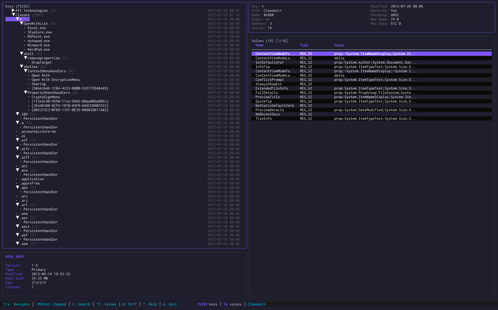

# hivekit

Cross-platform library and tools for Windows Registry hive files. Read, write, modify, and analyze registry hives in pure Go with no external dependencies.

## Overview

Hivekit provides both programmatic access and interactive tools for working with Windows Registry hive files (REGF format). It supports transaction-based editing, differential analysis, and comprehensive validation against real-world Windows hive files.

**Key Capabilities:**
- Transaction-based editing with copy-on-write semantics
- Full support for all list types (LF, LH, LI, RI) including indirect subkey lists
- Multi-HBIN support with proper boundary handling
- Unicode and special character support
- Differential analysis and merging
- Interactive TUI for exploration and forensics
- Validated against hivex on 146MB of real Windows registry data

## Installation

```bash
git clone https://github.com/joshuapare/hivekit.git
cd hivekit
make setup
```

## Tools

### hiveexplorer - Interactive TUI

Terminal-based user interface for exploring and analyzing registry hive files.



<!-- HIVEEXPLORER_HELP_START -->
```
hiveexplorer - Interactive TUI for Windows Registry Hive Files

USAGE:
  hiveexplorer <hive-file>

DESCRIPTION:
  Launches an interactive terminal UI for exploring Windows registry hive files.

  Features:
    - Split-pane layout (tree view + value table)
    - Keyboard navigation (vim-style keys supported)
    - Expand/collapse registry keys
    - View all value types with proper formatting
    - Search keys and values (/, Ctrl+F)
    - Bookmark keys (b)
    - Diff mode (Ctrl+D)
    - Real-time key statistics

  Navigation:
    ↑/k, ↓/j    Navigate up/down
    →/l, Enter  Expand key / Enter key
    ←/h         Collapse key / Go to parent
    Tab         Switch between tree and value panes
    ?           Show help
    q           Quit

OPTIONS:
  -h, --help     Show this help message
  -v, --version  Show version information

EXAMPLES:
  hiveexplorer system.hive
  hiveexplorer software.hive

For non-interactive operations, use the 'gohivex' command instead.
```
<!-- HIVEEXPLORER_HELP_END -->

### hivectl - Command Line Interface

Command-line tool for batch operations and automation.

<!-- HIVECTL_HELP_START -->
```
hivectl is a tool for inspecting, modifying, and analyzing
Windows Registry hive files. It supports reading, writing, merging, and exporting
registry data with comprehensive validation and safety features.

Usage:
  hivectl [command]

Available Commands:
  completion   Generate the autocompletion script for the specified shell
  defrag       Defragment and compact a hive file
  delete-key   Delete a registry key
  delete-value Delete a value from a registry key
  diagnose     Run comprehensive diagnostic scan on a hive file
  diff         Compare two hives and show differences
  dump         Human-readable dump of hive contents
  export       Export hive to .reg format
  get          Get a specific registry value
  help         Help about any command
  info         Validate a hive header and report basic metadata
  keys         List keys at a given path
  merge        Merge one or more .reg files into a hive
  repair       Apply repairs to a corrupted hive file
  search       Search for keys and values matching a pattern
  set          Set a registry value
  stats        Show detailed statistics
  tree         Display tree structure
  validate     Validate hive structure and limits
  values       List all values at a registry key

Flags:
  -h, --help       help for hivectl
      --json       Output in JSON format
      --no-color   Disable colored output
  -q, --quiet      Suppress all output except errors
  -v, --verbose    Enable verbose output
      --version    version for hivectl

Use "hivectl [command] --help" for more information about a command.
```
<!-- HIVECTL_HELP_END -->

**Examples:**
```bash
# Get a value
hivectl get system.hive "ControlSet001\Control" SystemStartOptions

# Set a value
hivectl set software.hive "Software\MyApp" Version --type REG_SZ --data "1.0.0"

# List keys
hivectl keys system.hive "ControlSet001\Control"

# Export to .reg format
hivectl export software.hive backup.reg

# Merge changes
hivectl merge system.hive changes.reg

# Compare hives
hivectl diff before.hive after.hive

# Validate structure
hivectl validate system.hive
```

## Library Usage

### Simple Operations

**Read a value:**
```go
package main

import (
    "fmt"
    "log"
    "github.com/joshuapare/hivekit/pkg/hive"
)

func main() {
    value, err := hive.GetValue("system.hive", "ControlSet001\\Control", "SystemStartOptions")
    if err != nil {
        log.Fatal(err)
    }
    fmt.Printf("%s = %s\n", value.Name, value.StringVal)
}
```

**Set a value:**
```go
err := hive.SetValue(
    "system.hive",
    "Software\\MyApp",
    "Version",
    hive.REG_SZ,
    []byte("1.0.0\x00\x00"),
    &hive.WriteOptions{CreateKey: true},
)
```

**Merge .reg file:**
```go
err := hive.MergeRegFile("system.hive", "changes.reg", nil)
```

**Export to .reg format:**
```go
err := hive.ExportReg("system.hive", "backup.reg", nil)
```

### Transaction API

For fine-grained control with atomic operations:

```go
package main

import "github.com/joshuapare/hivekit/pkg/hive"

func main() {
    r, _ := hive.Open("system.hive", hive.OpenOptions{})
    defer r.Close()

    ed := hive.NewEditor(r)
    tx := ed.Begin()

    // Multiple operations in a single transaction
    tx.CreateKey("Software\\MyApp", hive.CreateKeyOptions{CreateParents: true})
    tx.SetValue("Software\\MyApp", "Setting", hive.REG_DWORD, []byte{0x01, 0x00, 0x00, 0x00})
    tx.SetValue("Software\\MyApp", "Name", hive.REG_SZ, []byte("MyApp\x00\x00"))

    // Atomic commit
    w := &hive.FileWriter{Path: "output.hive"}
    tx.Commit(w, hive.WriteOptions{})
}
```

## C Bindings

The `bindings/` directory contains Go wrappers for the [libguestfs hivex](https://libguestfs.org/hivex.3.html) C library. These bindings serve two purposes:

**Benchmarking:** Used to compare hivekit's pure Go implementation against the industry-standard C implementation. All benchmark comparisons in this repository measure hivekit against hivex using these bindings.

**Integration:** If you have existing code that uses hivex or need to interface with C code, you can use these bindings alongside hivekit. The bindings provide a Go-idiomatic API around the generated C bindings.

**Note:** The bindings require libhivex to be installed on your system. The pure Go implementation in `pkg/hive` has no C dependencies.

## Testing

### Test Data

The library is validated against 16 test hives (146MB total):
- 4 custom test hives (minimal, special characters, large values, multi-HBIN)
- 12 real Windows hives from XP, Server 2003, Windows 8, and Server 2012

### Validation

Comprehensive testing against [hivex](https://libguestfs.org/hivex.3.html), the industry-standard registry library:

```bash
make test              # Run all tests
make test-unit         # Unit tests only
make test-integration  # Hivex compatibility tests
```

Results: 5/12 real Windows hives match hivex perfectly (100% node/value accuracy).

## Architecture

```
internal/
├── format/      # Binary format parsers (REGF, NK, VK, LF, LH)
├── reader/      # Hive reading with lazy loading
├── writer/      # Hive writing with dynamic allocation
├── edit/        # Transaction-based editing
│   ├── alloc.go    # HBIN-aware cell allocator
│   ├── planner.go  # Transaction planner
│   └── rebuild.go  # Hive rebuilding engine
├── mmfile/      # Memory-mapped file access
└── regtext/     # .reg file parser/writer

pkg/
├── hive/        # Public API (types, interfaces, operations)
└── types/       # Core type definitions

cmd/
├── hivectl/         # CLI tool
└── hiveexplorer/    # Interactive TUI
```

## Performance

Optimized for large hives:
- Lazy loading of tree structures
- Memory-mapped file access
- Efficient diff algorithms
- Copy-on-write for transactions

Tested with hives up to 34MB (Windows Server 2012 SOFTWARE hive with 82,000+ keys).

### Benchmarks

<!-- BENCHMARKS_START -->
Performance benchmarks comparing hivekit against hivex (libguestfs C implementation).

**Overall Performance:**
- Average speedup: **5.28x faster** than hivex
- Win rate: 73.4% (47 of 64 comparable operations)
- 2 hivekit-exclusive features

**Performance Highlights:**

| Operation | hivekit (ns/op) | hivex (ns/op) | Speedup |
|-----------|-----------------|---------------|---------|
| Root access | 2 | 37 | **17.6x** |
| ValueStructLength | 16 | 580 | **37.2x** |
| NodeName | 54 | 707 | **13.0x** |
| StatKey | 66 | 826 | **12.6x** |
| StatValue | 159 | 1.3K | **8.1x** |
| NodeGetValue | 260 | 1.3K | **5.1x** |
| NodeGetChild | 275 | 1.2K | **4.5x** |
| NodeChildren | 85 | 191 | **2.3x** |

See [BENCHMARKS.md](BENCHMARKS.md) for the complete report with all 66 operations, detailed graphs, and performance analysis by category.

Run `make benchmark-compare` to generate updated benchmark results.
<!-- BENCHMARKS_END -->

## Roadmap

- Parent key navigation optimization
- Security descriptor parsing
- Transaction log (HLOG) support
- Performance profiling and optimization

## Development

```bash
make help              # Show all available commands
make setup             # Environment setup
make test              # Run all tests
make build-hiveexplorer # Build TUI
make lint              # Run linters
make benchmark         # Performance benchmarks
```

## References

- [hivex documentation](https://libguestfs.org/hivex.3.html)
- [Windows Registry format specification](https://github.com/msuhanov/regf/blob/master/Windows%20registry%20file%20format%20specification.md)
- Test data from [hivex-test-data](https://github.com/libguestfs/hivex)

## License

[License TBD]
